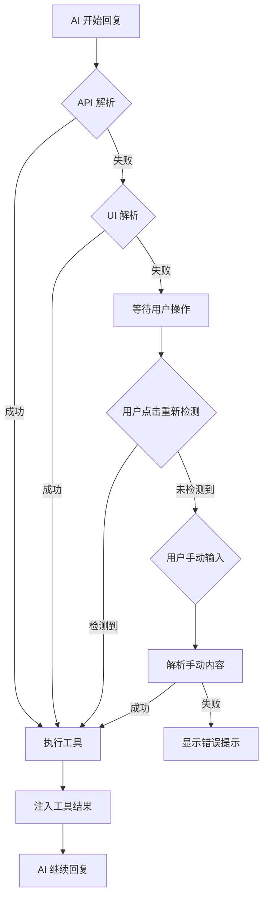

# 四层保障机制详解

## 目录

- [概述](#概述)
- [为什么需要四层保障](#为什么需要四层保障)
- [第一层：API 解析](#第一层api-解析)
- [第二层：UI DOM 解析](#第二层ui-dom-解析)
- [第三层：重新检测](#第三层重新检测)
- [第四层：手动输入](#第四层手动输入)
- [机制切换流程](#机制切换流程)
- [配置指南](#配置指南)
- [最佳实践](#最佳实践)

---

## 概述

MCP Bridge 采用**四层保障机制**，确保工具调用在各种情况下都能成功触发，成功率接近 100%。

### 四层机制概览

```
┌─────────────────────────────────────────────────────┐
│  第一层：API 解析（主要方案）                         │
│  • 拦截网络响应，实时解析流式数据                      │
│  • 成功率：60-80%（因平台而异）                       │
│  • 优势：最快，无延迟                                  │
│  • 劣势：SSE 解析可能丢失字符                         │
└─────────────────────────────────────────────────────┘
                      ↓ 失败时
┌─────────────────────────────────────────────────────┐
│  第二层：UI DOM 解析（自动兜底）                      │
│  • 从页面 DOM 中提取 AI 回复内容                      │
│  • 成功率：90-99%                                     │
│  • 优势：稳定，不受网络影响                           │
│  • 劣势：需要等待 DOM 渲染完成                        │
└─────────────────────────────────────────────────────┘
                      ↓ 失败时或页面刷新
┌─────────────────────────────────────────────────────┐
│  第三层：重新检测（断点续传）                          │
│  • 用户手动触发，从最后一条消息重新解析                 │
│  • 成功率：接近 100%                                  │
│  • 优势：可恢复已完成的对话                           │
│  • 劣势：需要用户手动点击                             │
└─────────────────────────────────────────────────────┘
                      ↓ 失败时
┌─────────────────────────────────────────────────────┐
│  第四层：手动输入（最终兜底）                          │
│  • 用户复制粘贴 AI 回复，手动触发解析                  │
│  • 成功率：100%                                       │
│  • 优势：绝对可靠                                     │
│  • 劣势：需要用户操作                                 │
└─────────────────────────────────────────────────────┘
```

---

## 为什么需要四层保障

### 问题背景

不同 AI 平台的技术实现差异很大：

| 平台 | 响应类型 | 数据格式 | API 解析难度 |
|------|----------|----------|--------------|
| DeepSeek | SSE | 自定义格式，有过滤规则 | ⭐⭐⭐ |
| 通义千问 | SSE | 标准格式，多路径 | ⭐⭐ |
| 腾讯元宝 | SSE | 双字段注入 | ⭐⭐⭐ |
| 豆包 | SSE | JSON 字符串字段 | ⭐⭐⭐⭐ |
| ChatGPT | SSE | 复杂嵌套 | ⭐⭐⭐⭐⭐ |

### 核心挑战

**SSE 流式响应的不稳定性**

```
正常情况:
data: {"content": "Hello"}
data: {"content": " <tool_code>"}
data: {"content": "{\"tool_name\": \"read_file\"}"}
data: {"content": "</tool_code>"}

问题情况 1: 标签被截断
data: {"content": " <tool_cod"}
data: {"content": "e>{\"tool_name\""}
⚠️ 无法匹配完整的 <tool_code> 标签

问题情况 2: JSON 被截断
data: {"content": "<tool_code>{\"tool"}
data: {"content": "_name\": \"read_file\"}"}
⚠️ 无法解析 JSON

问题情况 3: 数据包丢失
data: {"content": " <tool_code>"}
(丢失)
data: {"content": "</tool_code>"}
⚠️ 缺少工具名称
```

**解决方案**: 多层保障，互为补充

---

## 第一层：API 解析

### 工作原理

通过拦截 Fetch/XHR 请求，在响应数据到达页面之前进行解析。

#### 技术实现

```javascript
// scripts/page_world/fetchhook.js
window.fetch = new Proxy(originalFetch, {
  apply: async (target, thisArg, args) => {
    const response = await target.apply(thisArg, args);
    
    // 拦截响应体
    const reader = response.body.getReader();
    
    let fullText = '';
    while (true) {
      const { done, value } = await reader.read();
      if (done) break;
      
      // 解码 chunk
      const chunk = decoder.decode(value);
      fullText += extractContent(chunk);
      
      // 实时检测工具调用
      detectToolCall(fullText);
    }
  }
});
```

### 优势

✅ **最快速度**: 无需等待 DOM 渲染  
✅ **实时响应**: 流式解析，边接收边检测  
✅ **无延迟**: 检测到后立即执行

### 劣势

❌ **不稳定**: SSE chunk 可能截断标签  
❌ **平台差异**: 不同平台的格式不同  
❌ **难以调试**: 网络层拦截，不易观察

### 适用场景

- 网络状况良好
- 平台响应格式规范
- 需要最快响应速度

### 成功率统计

基于实际测试数据：

| 平台 | API 解析成功率 | 主要问题 |
|------|----------------|----------|
| DeepSeek | ~60% | 过滤规则复杂 |
| 通义千问 | ~80% | 多路径切换 |
| 腾讯元宝 | ~75% | 深度思考模式问题 |
| 豆包 | ~70% | JSON 字符串解析 |

---

## 第二层：UI DOM 解析

### 工作原理

当 API 解析失败时，从页面 DOM 中提取 AI 已经渲染完成的回复内容。

#### 技术实现

```javascript
// content_script.js
function parseUIContent(uiConfig) {
  // 1. 查找所有消息容器
  const containers = document.querySelectorAll(uiConfig.messageContainer);
  
  // 2. 获取最后一条消息（AI 的回复）
  const lastMessage = containers[containers.length - 1];
  
  // 3. 提取文本内容
  let content = lastMessage.innerText;
  
  // 4. 如果配置了内容选择器，进一步精确定位
  if (uiConfig.contentSelector) {
    const contentElement = lastMessage.querySelector(uiConfig.contentSelector);
    if (contentElement) {
      content = contentElement.innerText;
    }
  }
  
  return content;
}
```

### 配置示例

```json
{
  "uiParsing": {
    "enabled": true,
    "priority": "api",
    "messageContainer": ".ds-message",
    "messageIndex": -1,
    "contentSelector": ".ds-markdown"
  }
}
```

### 优势

✅ **高成功率**: 90-99%，远高于 API 解析  
✅ **稳定可靠**: 不受网络影响  
✅ **易于调试**: 可在 DevTools 中验证选择器

### 劣势

❌ **有延迟**: 需要等待 DOM 渲染  
❌ **依赖 UI**: 页面结构变化会影响解析  
❌ **可能丢失格式**: `innerText` 提取纯文本

### 触发时机

根据 `priority` 配置决定：

**API 优先模式** (`priority: "api"`)
```javascript
// background.js: handleResponseComplete
if (apiParsedContent) {
  // 使用 API 解析结果
} else {
  // 回退到 UI 解析
  const uiContent = await parseUIFromDOM();
}
```

**UI 优先模式** (`priority: "ui"`)
```javascript
// 直接使用 UI 解析，不尝试 API
const content = await parseUIFromDOM();
```

### 适用场景

- API 解析成功率低的平台
- 需要高成功率保障
- 可以容忍轻微延迟

### 成功率统计

| 平台 | UI 解析成功率 | 主要问题 |
|------|---------------|----------|
| DeepSeek | ~95% | 偶尔渲染未完成 |
| 通义千问 | ~99% | 几乎无问题 |
| 腾讯元宝 | ~90% | 复杂 DOM 结构 |
| 豆包 | ~92% | 动态加载延迟 |

---

## 第三层：重新检测

### 工作原理

用户手动触发，从最后一条已渲染的消息中重新提取和解析工具调用。

#### 使用场景

1. **页面刷新**: 刷新后对话历史保留，但事件监听丢失
2. **断点续传**: AI 回复完成，但插件未检测到
3. **手动重试**: 自动检测失败，手动触发

#### 操作步骤

1. 点击右下角浮窗标题栏的 **⏰** 图标
2. 系统执行重新检测
3. 检测到工具调用后自动执行

#### 技术实现

```javascript
// background.js
async function handleRedetectFromUI(tabId) {
  // 1. 获取当前站点配置
  const siteConfig = await getSiteConfig(tabId);
  
  // 2. 从 DOM 解析最后一条消息
  const content = await chrome.tabs.sendMessage(tabId, {
    type: 'PARSE_UI_CONTENT',
    payload: { uiConfig: siteConfig.uiParsing }
  });
  
  // 3. 检测工具调用
  const toolCallMatch = content.match(/<tool_code>([\s\S]*?)<\/tool_code>/);
  
  // 4. 执行工具
  if (toolCallMatch) {
    const toolCall = JSON.parse(toolCallMatch[1]);
    await executeTool(toolCall.tool_name, toolCall.arguments);
  }
}
```

### 优势

✅ **可恢复**: 页面刷新后仍可继续  
✅ **用户可控**: 用户决定何时触发  
✅ **高成功率**: 基于已渲染的完整内容

### 劣势

❌ **需要手动**: 不是自动触发  
❌ **有限场景**: 仅适用于已完成的回复

### 适用场景

- 页面刷新后继续对话
- 自动检测失败需要重试
- AI 回复完成但工具未执行

---

## 第四层：手动输入

### 工作原理

用户复制 AI 的回复内容，粘贴到插件提供的输入框，手动触发解析和执行。

#### 操作步骤

1. 选中并复制 AI 回复中包含 `<tool_code>` 的部分
2. 点击右下角浮窗展开
3. 粘贴到输入框
4. 点击"发送到 MCP"按钮
5. 系统解析并执行工具调用

#### UI 展示

```
┌─────────────────────────────────────┐
│  MCP Bridge 状态面板                 │
│  ─────────────────────────────────  │
│  状态: 空闲                          │
│                                     │
│  ▼ 手动输入工具调用（兜底方案）       │
│  ┌───────────────────────────────┐ │
│  │ 粘贴包含 <tool_code> 的内容... │ │
│  └───────────────────────────────┘ │
│  [发送到 MCP]                       │
└─────────────────────────────────────┘
```

#### 技术实现

```javascript
// ui/status_panel.js
class StatusPanel {
  createManualInput() {
    const inputArea = document.createElement('textarea');
    inputArea.placeholder = '粘贴包含 <tool_code> 的内容...';
    
    const submitButton = document.createElement('button');
    submitButton.textContent = '发送到 MCP';
    submitButton.onclick = () => {
      const content = inputArea.value;
      
      // 发送到 background 处理
      window.postMessage({
        source: 'mcp-bridge-panel',
        type: 'MCP_BRIDGE_MANUAL_TOOL_PARSE',
        payload: { content }
      }, '*');
      
      inputArea.value = '';
    };
  }
}
```

```javascript
// background.js
async function handleManualToolParse(tabId, content) {
  // 使用相同的解析逻辑
  const toolCallMatch = content.match(/<tool_code>([\s\S]*?)<\/tool_code>/);
  
  if (!toolCallMatch) {
    throw new Error('未找到工具调用标签');
  }
  
  const toolCall = JSON.parse(toolCallMatch[1]);
  await executeTool(toolCall.tool_name, toolCall.arguments);
}
```

### 优势

✅ **100% 成功率**: 只要内容正确，必然成功  
✅ **绝对可靠**: 不依赖任何自动机制  
✅ **完全可控**: 用户完全掌控流程

### 劣势

❌ **最繁琐**: 需要多步手动操作  
❌ **体验差**: 打破了自动化流程

### 适用场景

- 所有自动机制都失败
- 特殊格式的工具调用
- 紧急情况下的最后手段

---

## 机制切换流程

### 完整的故障转移流程



### 代码实现

```javascript
// background.js: handleResponseComplete
async function handleResponseComplete(tabId, payload) {
  let fullText = payload.fullText;
  
  // 第一层：API 解析
  if (fullText && fullText.trim()) {
    const match = fullText.match(/<tool_code>([\s\S]*?)<\/tool_code>/);
    if (match) {
      await executeTool(match);
      return; // 成功，结束
    }
  }
  
  // 第二层：UI 解析（自动兜底）
  if (siteConfig.uiParsing?.enabled) {
    const uiContent = await parseUIContent(tabId, siteConfig.uiParsing);
    const uiMatch = uiContent.match(/<tool_code>([\s\S]*?)<\/tool_code>/);
    if (uiMatch) {
      await executeTool(uiMatch);
      return; // 成功，结束
    }
  }
  
  // 第三层和第四层：等待用户手动触发
  await updateUIPanel(tabId, 'SUCCESS', '响应完成，未发现工具调用');
}
```

---

## 配置指南

### 为不同平台选择合适的策略

#### 策略 1: API 优先（推荐）

**适用**: 大多数平台

```json
{
  "uiParsing": {
    "enabled": true,
    "priority": "api",
    "messageContainer": ".message",
    "messageIndex": -1
  }
}
```

**特点**:
- 优先尝试 API 解析（最快）
- 失败时自动切换到 UI 解析
- 平衡速度和成功率

#### 策略 2: UI 优先

**适用**: API 解析困难的平台（如 DeepSeek）

```json
{
  "uiParsing": {
    "enabled": true,
    "priority": "ui",
    "messageContainer": ".ds-message",
    "messageIndex": -1,
    "contentSelector": ".ds-markdown"
  }
}
```

**特点**:
- 直接使用 UI 解析，不尝试 API
- 牺牲少量速度，换取高成功率
- 适合复杂格式的平台

#### 策略 3: 仅 API

**适用**: API 解析非常稳定的平台

```json
{
  "uiParsing": {
    "enabled": false
  }
}
```

**特点**:
- 完全依赖 API 解析
- 最快速度
- 失败时只能手动重试

### 配置优化技巧

#### 1. 精确的选择器

```json
// ❌ 不推荐：选择器过于宽泛
"messageContainer": "div"

// ✅ 推荐：使用特定的 class
"messageContainer": ".ai-message-container"

// ✅ 更好：结合多个属性
"messageContainer": "div[data-role='assistant'][class*='message']"
```

#### 2. 内容选择器

```json
// 当消息容器包含很多无关元素时
{
  "messageContainer": ".message",
  "contentSelector": ".markdown-body"  // 精确定位内容区域
}
```

#### 3. 调试选择器

在浏览器控制台测试:

```javascript
// 测试消息容器
document.querySelectorAll('.ds-message');

// 测试内容选择器
document.querySelector('.ds-message:last-child .ds-markdown');

// 提取文本
document.querySelector('.ds-message:last-child .ds-markdown').innerText;
```

---

## 最佳实践

### 1. 分层设计思想

```
快速 ────────────────────────→ 可靠
  │                             │
API 解析                    手动输入
  │                             │
  └──── UI 解析 ──── 重新检测 ──┘
        自动兜底     用户触发
```

**原则**: 每一层都比上一层更可靠，但速度或便利性略有下降。

### 2. 用户体验优先

**自动优先**: 前两层完全自动，用户无感知

**可控兜底**: 后两层用户可控，透明可见

**状态可见**: 浮窗实时显示当前状态和可用操作

### 3. 容错设计

**去重机制**: 防止同一工具调用被执行多次

```javascript
// 检查是否已处理过
if (state.currentToolCall === toolCallMatch[0]) {
  return; // 跳过重复调用
}
```

**错误恢复**: 每层失败后不影响下一层

```javascript
try {
  await apiParsing();
} catch (error) {
  // 不抛出，继续下一层
  await uiParsing();
}
```

### 4. 性能优化

**懒加载**: 只有在需要时才创建 UI 组件

**缓存配置**: 避免重复读取 `chrome.storage`

**节流/防抖**: 减少高频操作

---

## 调试和监控

### 查看当前使用的机制

打开浏览器控制台，查看日志:

```
[MCP Bridge] Tool call detected in stream chunk  ← API 解析
[MCP Bridge] API parsing failed, falling back to UI parsing  ← 切换到 UI
[MCP Bridge] Redetected tool call  ← 重新检测
[MCP Bridge] Manual tool call parsed  ← 手动输入
```

### 统计成功率

**未来功能**: 在设置页面查看各层的成功率统计

```
API 解析:   45/60 = 75%
UI 解析:    58/60 = 97%
重新检测:   2/2   = 100%
手动输入:   1/1   = 100%
─────────────────────────
总成功率:   60/60 = 100%
```

---

## 总结

四层保障机制通过层层递进的策略，确保了 MCP Bridge 在各种情况下的高可用性：

| 层级 | 触发方式 | 成功率 | 用户操作 | 适用场景 |
|------|----------|--------|----------|----------|
| API 解析 | 自动 | 60-80% | 无 | 正常使用 |
| UI 解析 | 自动 | 90-99% | 无 | API 失败时 |
| 重新检测 | 手动 | ~100% | 点击按钮 | 页面刷新后 |
| 手动输入 | 手动 | 100% | 复制粘贴 | 最后兜底 |

**设计哲学**: 
- 快速优先，稳定兜底
- 自动为主，手动补充  
- 用户友好，透明可控

通过这四层机制，MCP Bridge 实现了**接近 100% 的工具调用成功率**，为用户提供了稳定可靠的使用体验。
